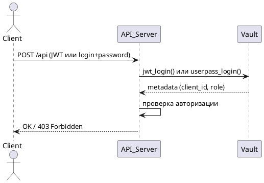

# Vault: Инструкция администратора и схема работы сервера (v2)

---

## 📁 Часть 1. Инструкция администратора по конфигурированию Vault

### 🎯 Назначение

Настроить Vault как **внутренний механизм аутентификации** клиентов (через JWT и логин/пароль), с использованием:
- **одной универсальной JWT-роли (`dynamic`)**;
- **метаданных токена для определения прав клиента**;
- **userpass** для сервисов без поддержки JWT.

---

### ⚙️ Шаги настройки

#### 1. Запуск Vault

```bash
vault server -config=vault.hcl
vault operator init
vault operator unseal
vault login <root_token>
````

---

#### 2. Включить методы аутентификации

```bash
vault auth enable userpass
vault auth enable jwt
```

---

#### 3. Создать заглушечную (нулевую) политику

```bash
vault policy write noop-policy - <<EOF
path "*" {
  capabilities = []
}
EOF
```

---

#### 4. Настроить userpass-пользователя (например, client2)

```bash
vault write auth/userpass/users/service \
    password="strong_password" \
    policies="noop-policy" \
    metadata="client_id=client2,role=service"
```

---

#### 5. Настроить JWT backend

```bash
vault write auth/jwt/config \
    oidc_discovery_url="http://127.0.0.1:8200/v1/identity/oidc" \
    bound_issuer="vault"
```

---

#### 6. Создать **универсальную JWT-роль**

```bash
vault write auth/jwt/role/dynamic \
    role_type="jwt" \
    bound_subject="*" \
    user_claim="sub" \
    bound_issuer="vault" \
    metadata_claims="client_id,role" \
    policies="noop-policy" \
    ttl="1h"
```

---

#### 7. Выпустить JWT-токен (опционально, если не выдаётся внешне)

```bash
vault write identity/oidc/token \
    subject="client3" \
    metadata="client_id=client3,role=admin" \
    policies="noop-policy" \
    ttl="3600"
```

---

#### 8. Пример JWT-полезной нагрузки (`payload`)

```json
{
  "iss": "vault",
  "sub": "client1",
  "client_id": "client1",
  "role": "copytrust_site",
  "exp": 1718959200
}
```

---

## ✅ Результат

Vault настроен для аутентификации клиентов через:

* **userpass** (логин/пароль)
* **JWT** (универсальная роль `dynamic`)

Права клиента описываются в `metadata`, возвращаемой Vault.

---

## 🧩 Часть 2. Схема работы сервера при аутентификации и авторизации

### 📌 Цель

Использовать Vault для проверки подлинности клиента, а затем:

* Извлечь `client_id`, `role` из `auth.metadata`
* Применить собственную логику авторизации

---

### 🔁 Алгоритм работы сервера

```python
def authenticate_and_authorize(request):
    if request.jwt_token:
        auth_info = vault_client.jwt_login(jwt=request.jwt_token, role="dynamic")
    elif request.username and request.password:
        auth_info = vault_client.userpass_login(username=request.username, password=request.password)
    else:
        raise Unauthorized("Missing credentials")

    role = auth_info["metadata"].get("role")
    client_id = auth_info["metadata"].get("client_id")

    if not is_authorized(role, request.action):
        raise Forbidden("Not allowed")

    return proceed_with_action(client_id, role)
```

---

### 🔐 Пример логики авторизации

```python
def is_authorized(role: str, action: str) -> bool:
    return {
        "admin": lambda: True,
        "service": lambda: action in ["calc_hash", "water_marks"],
        "copytrust_site": lambda: action == "calc_hash"
    }.get(role, lambda: False)()
```

---

### 📦 Пример ответа от Vault (jwt или userpass login)

```json
{
  "auth": {
    "client_token": "hvs.xxxxx",
    "entity_id": "2e3f-...",
    "policies": ["noop-policy"],
    "metadata": {
      "client_id": "client1",
      "role": "copytrust_site"
    }
  }
}
```

---

### 📑 Поток вызовов (UML диаграмма)



---

## 🧾 Итоговая модель

| Компонент  | Функция                                                       |
| ---------- | ------------------------------------------------------------- |
| Vault      | Аутентификация (jwt/userpass), возврат метаданных клиента     |
| Vault Role | Общая (`dynamic`) для JWT + индивидуальная для userpass       |
| Metadata   | Источник бизнес-роли и ID клиента                             |
| Политики   | Заглушечные (используются только формально)                   |
| Сервер     | Выполняет авторизацию на основе `role`, `action`, `client_id` |
